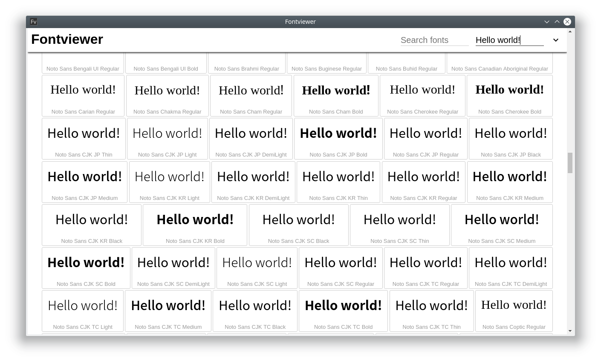

#  Fontviewer



You can check and search fonts you have.
And you can change the color.

## Installation

If you use windows, you also may need to install the windows-build-tools package.
```sh
npm -g install windows-build-tools
```

If you use linux, you also may need to install the libfontconfig-dev package.
For example:
```sh
sudo apt-get install libfontconfig-dev
```

Download this repository.
```sh
git pull https://github.com/ssssota/fontviewer.git
```

Install node packages.
```sh
npm install
```

Rebuild libraries for electron.
```sh
npm run rebuild-lib
```

## Usage

Launch
```sh
npm start
```

Debug
```sh
npm run debug
```

Build
```sh
# build for mac
npm run build:mac

# build for windows
npm run build:windows

# build for linux
npm run build:linux
```

## License

The MIT License.